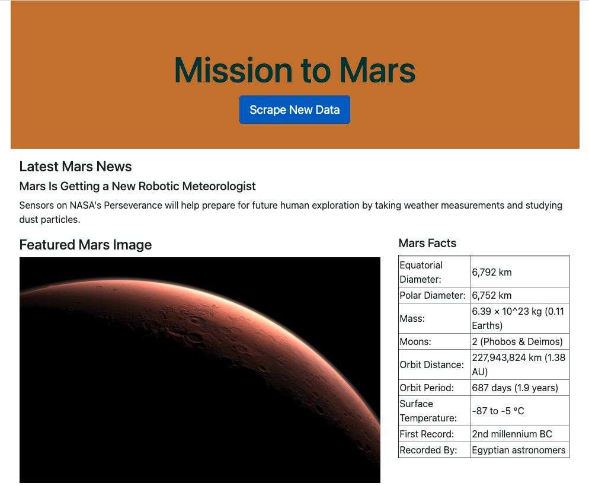
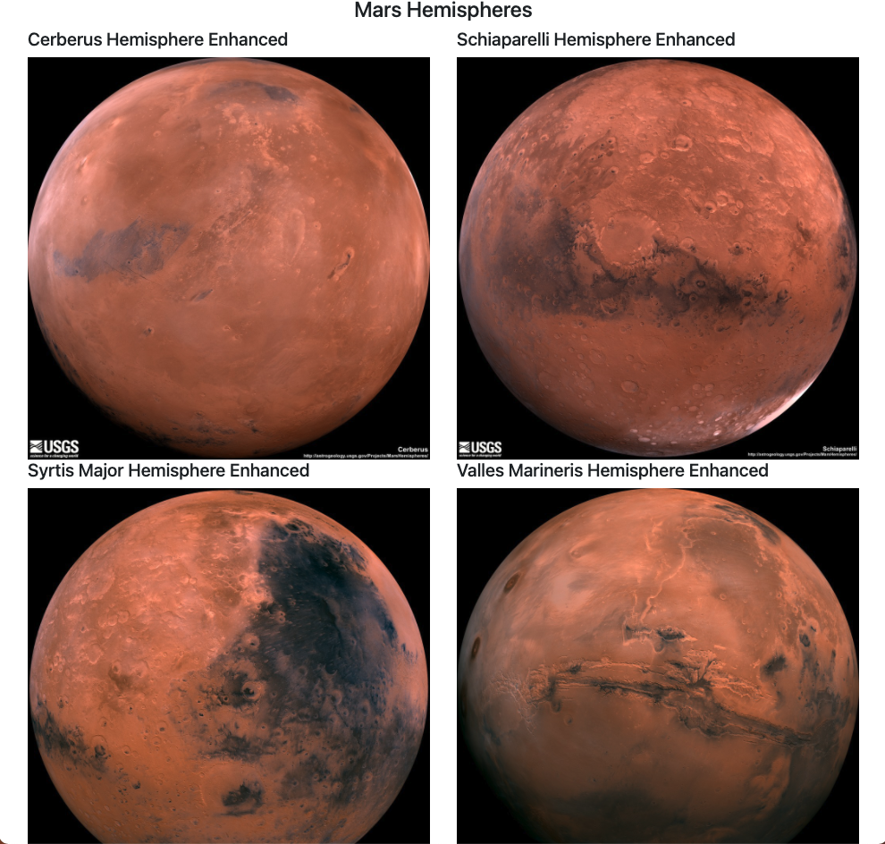

# web-scraping-challenge

## Background
Build a web application that scrapes various websites for data related to the Mission to Mars and display the information in a single HTML page.

## Technologies Used
- Python
- Selenium
- Beautifiul Soup
- Pandas
- Flask
- Jinja
- MongoDB
- Pymongo

## Objectives
1. Web Scraping:
    - NASA Mars News
    - JPL Mars Space Images - Featured Image
    - Mars Facts
    - Mars Hamispheres
2. MongoDB and Flask Application
    - Convert scraping file into a script with a scrape function that will execulte all scraping code and return a Python dictionary containing all retrieved data. 
    - Create a scrape route that will import the scrape function and store the returned value in MongoDB as a Python dictionary.
    - Create a root route that will query the Mongo database and pass the data into an HTML template to display the data.
    - Create an HTML file that will take the mars data dictioary and display all data on the page. 

 


### Web Scraping

#### Nasa Mars News
```python 
# establish url and scrape web page
url = "https://mars.nasa.gov/news/"

driver.get(url)
driver.implicitly_wait(10)
html = driver.page_source

# pass to bs4 for parsing
soup = BeautifulSoup(html, "html.parser")

# extract news titles
news_titles = soup.find_all("li", class_="slide")

# extract latest news title and assign to variable
latest = news_titles[0].find("div", class_="content_title")
news_title = latest.text.strip()

# extract latest news paragraph text and assign to variable
p_text = news_titles[0].find("div", class_="article_teaser_body")
news_p = p_text.text.strip()
```

#### JPL Mars Space Images - Featured Image
```python 
# establish url and go seach Mars images
base_url = "https://www.jpl.nasa.gov"
url = base_url + "/spaceimages/?search=&category=Mars"

driver.get(url)
driver.implicitly_wait(10)

# navigate web page to find large image url
driver.find_element_by_link_text("FULL IMAGE").click()
driver.find_element_by_partial_link_text("more info").click()

# scrape page
driver.implicitly_wait(10)
html = driver.page_source

# pass to bs4 for parsing
soup = BeautifulSoup(html, "html.parser")

main_img = soup.find_all("img", class_="main_image")

# extract out src attribute
src = ""

for image in main_img:
    src = image["src"]

# combine base url with src string and assign to variable
featured_image_url = base_url + src
```

#### Mars Facts
```python
# establish url and scrape web page
url = "https://space-facts.com/mars/"

driver.get(url)
driver.implicitly_wait(10)
html = driver.page_source

# pass to bs4 for parsing
soup = BeautifulSoup(html, "html.parser")

tables = soup.find_all("table")

# index for info only on the mars facts table
facts_table = tables[0]

# extract data from the facts table
table_data = [[cell.text for cell in row.find_all(["th", "td"])] for row in facts_table.find_all("tr")]

# convert to dataframe
df = pd.DataFrame(table_data)

# rename columns
df.rename(columns = {0 : "", 1: ""}, inplace=True)

#save html of table to a string
mars_table = df.to_html(index=False)
```

#### Mars Hemispheres
```python 
# establish url and scrape web page
base_url = "https://astrogeology.usgs.gov"
url = base_url + "/search/results?q=hemisphere+enhanced&k1=target&v1=Mars"

driver.get(url)
driver.implicitly_wait(10)
html = driver.page_source

soup = BeautifulSoup(html, "html.parser")

# remove all h3 tags from list
titles = [h3.text.strip() for h3 in soup.find_all("h3")]

# loop through list of titles to navigate to each page and extract html from each
html_pages = []
for title in titles:
    driver.get(url)
    driver.implicitly_wait(10)
    driver.find_element_by_link_text(title).click()
    driver.implicitly_wait(10)
    html_pages.append(driver.page_source)

# convert list into a string for bs4
html = " ".join(map(str, html_pages))

# pass to bs4 for parsing
soup = BeautifulSoup(html, "html.parser")

img_urls = soup.find_all("img", class_="wide-image")

# extract all src attributes
img_srcs = []
for img in img_urls:
    img_srcs.append(img["src"])

# add base url to img_srcs
urls = [(base_url + e) for e in img_srcs]

# zip lists together in tuples for converting to list of dicts
tuple_list = list(zip(titles, urls))

# keys for list of dictionaries for each hemisphere
keys = ("title", "img_url")

# zip the list of keys and values together for each tuple in the list
hemisphere_img_urls = [dict(zip(keys, values)) for values in tuple_list]
```

### MongoDB and Flask Application

#### App Routes
```python
driver = configure_chrome_driver()

# set up connections to Mongo Database
CONN = os.getenv("CONN")
client = pymongo.MongoClient(CONN)
db = client.mars

app = Flask(__name__)

@app.route("/")
def main():

    mars_data = db.mars.find_one()
    return render_template("index.html", mars_data=mars_data)

@app.route("/scrape")
def scrape_route():
    db.mars.drop()
    db.mars.insert_one(scrape(driver))
    return redirect("/", code=303)

if __name__ == "__main__":
    app.run(debug=True)
```